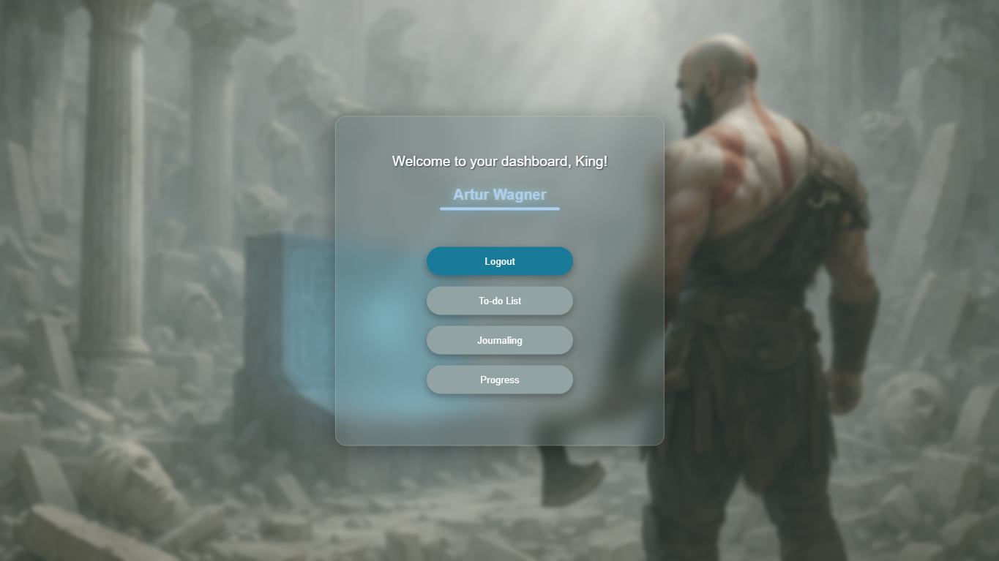

# 🛡️ Ragnarok Discipline App



A personal productivity platform focused on self-mastery and consistency.  
This app combines a simple To-Do list, journaling system, and a visual progress page — all in one place.  
Designed to help you stay focused, track your habits, and reflect daily.

---

## ⚙️ Features

- ✅ Add, edit and remove tasks with local persistence  
- 🧠 Write daily journal entries with automatic date storage  
- 📊 Visual progress section (mocked for now, future-ready)  
- 💾 Everything saved with `localStorage`  
- 🔐 Includes Login, Register and Reset Password (static / WIP)  
- 📱 Fully responsive and styled with custom design  

---

## 🛠️ Tech Stack

- React  
- JavaScript (ES6+)  
- CSS (custom)  
- React Router  
- LocalStorage API  

---

## ▶️ How to Run Locally

```bash
git clone https://github.com/your-username/your-repo-name.git
cd your-repo-name
npm install
npm start

---

🌍 Live Preview
Check it out here: https://ragnarok-discipline.vercel.app
